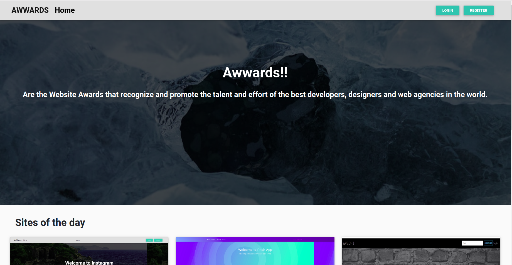
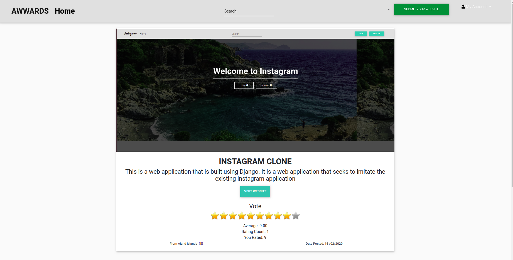
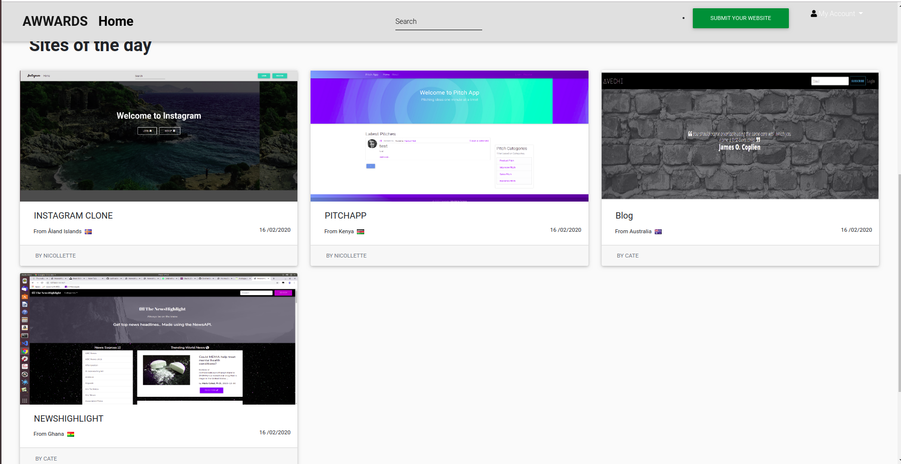

## PROJECT NAME 
**AWWARDS**

## AUTHOR 
**CATHERINE**

## DESCRIPTION
- This project allows users to post their projects for other users to rate according to design, usability and content 

## BDD 
- Users need to Sign in to the application to post projects and review projects

- Users can post a project to be rated/viewed.

## User Story

- Users need to Sign in to the application to post projects and review projects.

- Users can view different projects and their details. 

- Users can post a project to be rated/viewed.

- Users can search for different projects.

-  Users can view projects overall score. 

-  Users can view their profile page with all their published projects. 

-  Users can rate/review other users' projects.

# **SETUP/INSTALLATION.**

*** To view the app.Visit -> [Reviewsclone](https://github.com/catherine244/Reviews)

1. Clone this repo: git clone https://github.com/catherine244/Reviews.git.
2. The repo comes in a zipped or compressed format. Extract to your prefered location and open it.
3. open your terminal and navigate to gallery then create a virtual environment.For detailed guide refer  [here](https://packaging.python.org/guides/installing-using-pip-and-virtualenv/)
3. To run the app, you'll have to run the following commands in your terminal
    
    
       pip install -r requirements.txt
4. On your terminal,Create database awwards using the command below.

       CREATE DATABASE awwards; 
       **if you opt to use your own database name, replace awwards your preferred name, then also update settings.py variable DATABASES > NAME

5. Migrate the database using the command below

       python3.6 manage.py migrate
6. Then serve the app, so that the app will be available on localhost:8000, to do this run the command below

       python manage.py runserver
7. Use the navigation bar/navbar/navigation pane/menu to navigate and explore the app.

# Technologies Used

* Python 3.6
* Django
* Postgresql
* MDBootstrap

## APIs 
This application comes with two API Endpoints for Profiles and Projects.

- Profiles API Endpoint - https://cateawward.herokuapp.com/api/profiles/ 

- Projects API Endpoint - https://cateawward.herokuapp.com/api/projects/